# Step-by-Step Walkthrough — TheHive + Cortex Live IOC Triage

This is the full step-by-step record of the case, end to end, with every
screenshot in the order it happened. Short summary version is in the main
[README](README.md); raw analyzer output is in [notes.md](notes.md).

---

## Why

Most TheHive/Cortex walkthroughs use sample data like `8.8.8.8` and
`example.com`. To make the practice closer to an actual Tier 1 shift, this
run uses a real, currently active indicator pulled live from
[URLhaus](https://urlhaus.abuse.ch/) instead.

**Environment:** TheHive 3 + Cortex + Elasticsearch, running as Docker
containers in a local lab VM.

**Indicator used:**
```
http://46.200.4.39:45202/i
```
Pulled from `urlhaus.abuse.ch/browse/`, filtered to `status: online` at time
of triage. URLhaus is a free, community-run feed built specifically for
looking up and blocking malware infrastructure — safe to query for that
reason. The URL itself was never opened in a browser; only the text value
was used as an observable.

---

## Step 1 — Empty Case Queue

Fresh TheHive instance. No cases, no tasks, no alerts. This is the queue
view before any work starts.

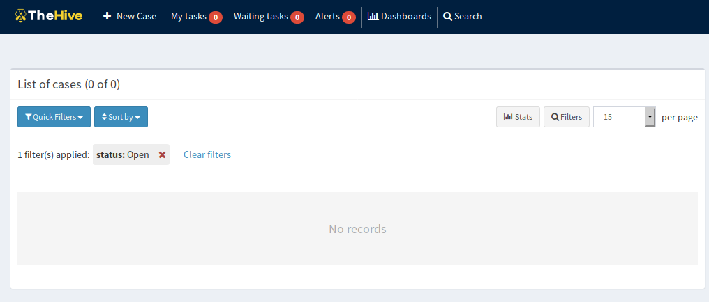

---

## Step 2 — Opening the Case

Clicked **+ New Case** and filled it in like a real ticket instead of a
placeholder. Severity set to High, TLP/PAP set to Amber since this is a
confirmed-active malicious host. Description written like an actual
proxy-log finding. Two tasks defined up front so the case has a clear
workflow before the first one is even opened.

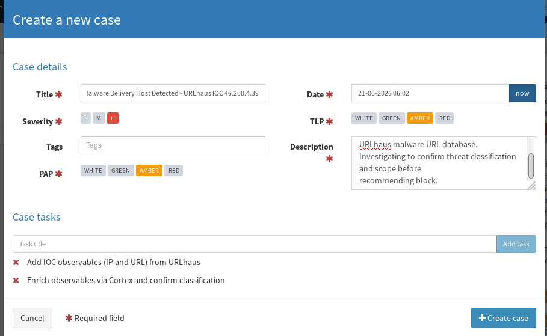

**Why TLP:Amber here:** Traffic Light Protocol controls how far an
indicator/case can be shared. Amber means "share only within your org and
with people who need it" — appropriate for an active IOC investigation that
hasn't been validated for wider release yet.

---

## Step 3 — Case Created

Case is live. Two tasks sitting in "Waiting," nobody assigned yet. This is
how TheHive behaves in a multi-analyst setup: tasks stay unassigned until
someone actually claims them, even on a case you created yourself.

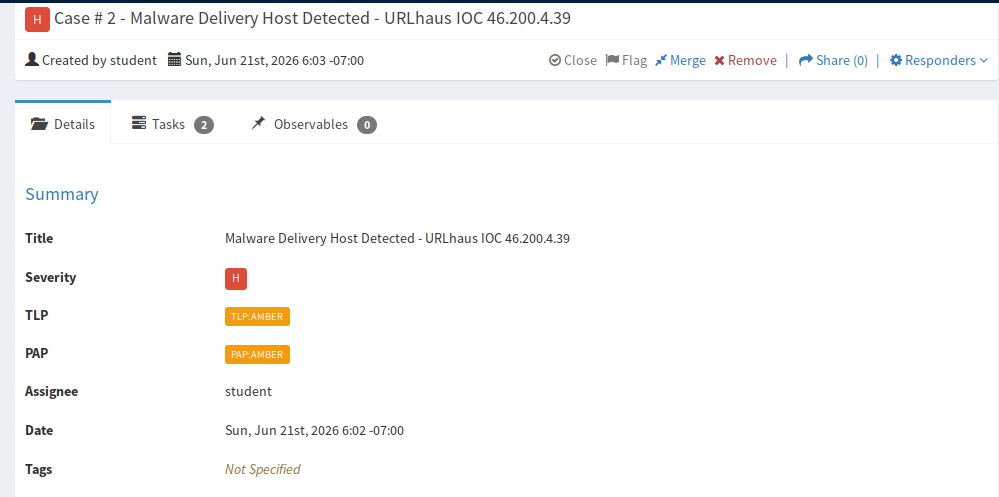

---

## Step 4 — Task Queue

Switched to the Tasks tab. Both tasks visible, both unassigned — the to-do
list for the case: add the IOC, then enrich it.

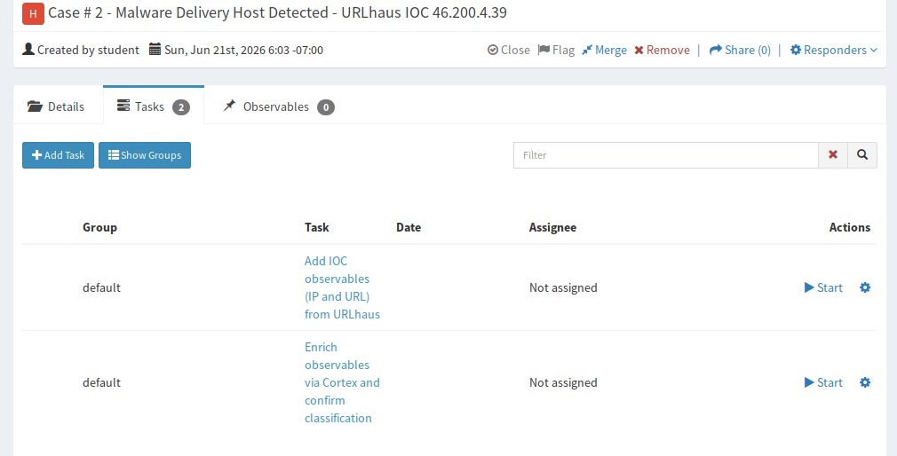

---

## Step 5 — Logging the URL Observable

Started Task 1 and added the full malicious URL as an observable, type
`url`. Marked **Is IOC** as true since this is a confirmed indicator, not
just a sighting. Kept TLP:Amber consistent with the case.

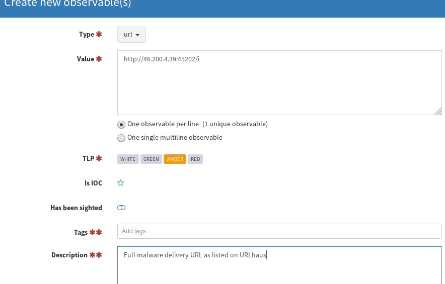

---

## Step 6 — Both Observables Logged

Added the IP (`46.200.4.39`) as a second observable right after. TheHive
auto-defangs both values in the list (`hxxp://`, `46[.]200[.]4[.]39`) so
nobody accidentally clicks a live link off the case page — useful when
cases get shared around a team.

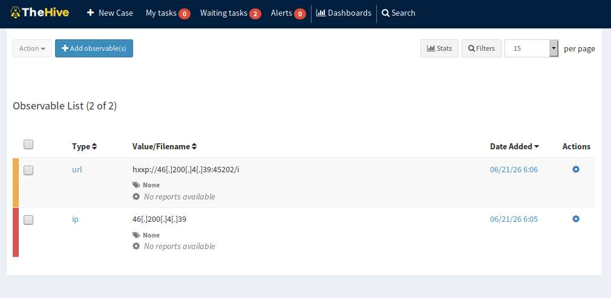

---

## Step 7 — Selecting Observables for Enrichment

Moved to Task 2. Selected both observables and opened the Action menu to
run Cortex analyzers against them — automation instead of manually
checking each IOC across several different sites by hand.

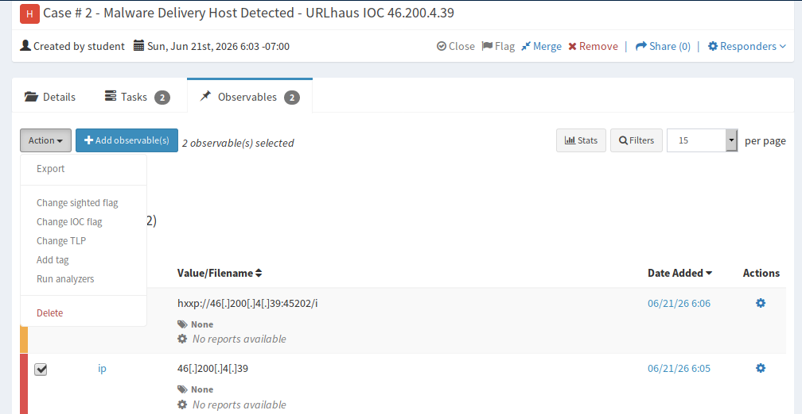

---

## Step 8 — Analyzers Running

Confirmation that the analyzer jobs started successfully for both
observables. Behind the scenes, Cortex is now running `GoogleDNS_resolve`
and `Abuse_Finder` — both free, no API key needed, which matters a lot when
running this in a personal lab with no paid threat intel subscriptions.

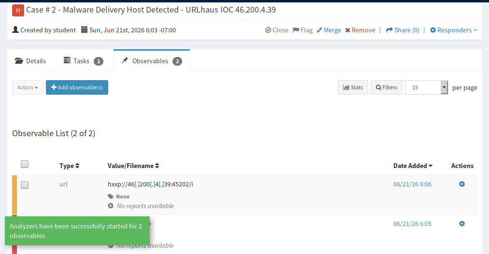

---

## Step 9 — Task 1 Detail View

The task-level detail screen — assignee, status (`InProgress`), and how
long it's been open. In a real SOC, this duration feeds SLA/MTTR tracking,
so it's worth getting comfortable with this view early.

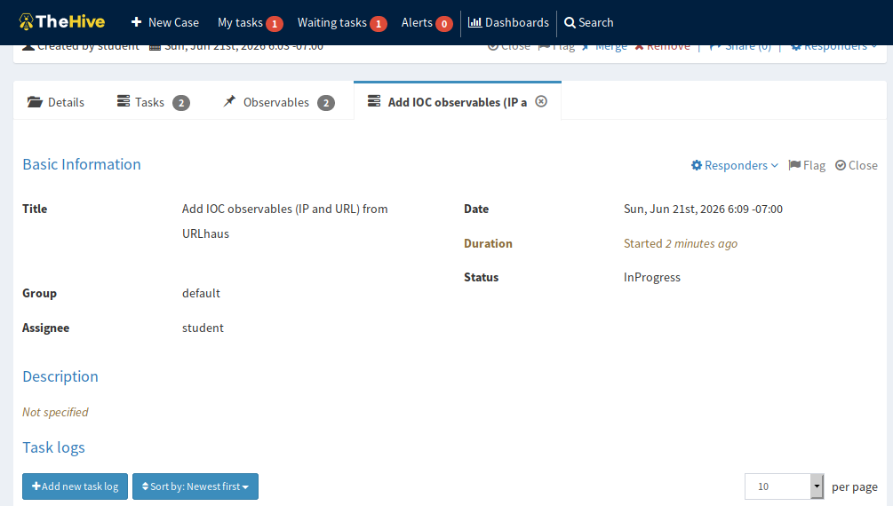

---

## Step 10 — Task 2 Detail View

Same view for Task 2, now in progress while Cortex works in the
background.

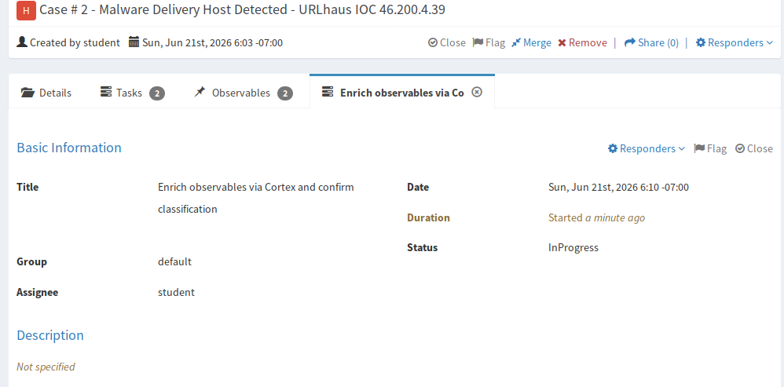

---

## Step 11 — Abuse_Finder Result

First analyzer result. `Abuse_Finder` traced the IP back to an aggregate
IP block registered to a telecom provider and surfaced an abuse contact
email — useful if pushing for takedown, without leaving TheHive.

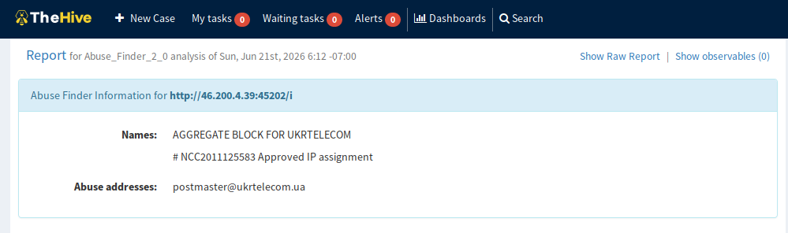

---

## Step 12 — GoogleDNS_resolve Result

Second analyzer — PTR lookup on the IP. It resolves to a generic
pool-style hostname under the same provider's domain, which lines up with
the `Abuse_Finder` result. Two independent analyzers agreeing on the same
hosting provider is a small but real confidence signal.

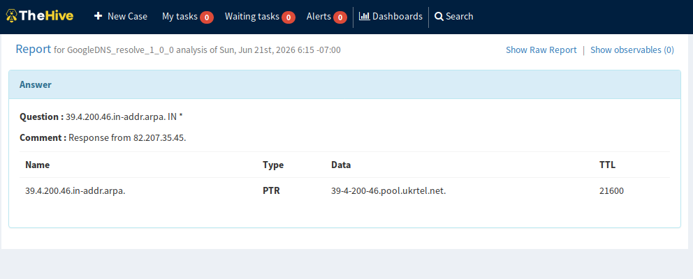

**Reading this like an analyst:**
- Hosting provider confirmed twice (`Abuse_Finder` + PTR) — consistent, not contradictory
- Pool-style PTR naming suggests dynamic/residential-leaning IP space, common for botnet or compromised-host infrastructure rather than dedicated hosting
- Abuse contact captured now, so escalation/reporting doesn't need a second lookup later

---

## Step 13 — Closing the Case

With both tasks closed, the case itself was closed. Status set to **True
Positive** (confirmed-active malicious host, not a maybe), Impact set to
Yes, and a summary written that someone picking up this case cold could
read in ten seconds and understand exactly what happened and what to do
next.

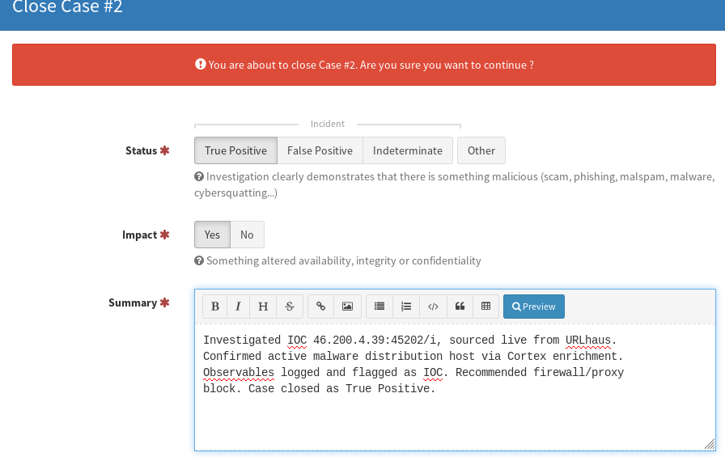

**Closure summary (as written in TheHive):**
> Investigated IOC 46.200.4.39:45202/i, sourced live from URLhaus.
> Confirmed active malware distribution host via Cortex enrichment.
> Observables logged and flagged as IOC. Recommended firewall/proxy block.
> Case closed as True Positive.

---

## What This Demonstrated

**TheHive workflow concepts**
- Cases → Tasks → Observables → Task logs is the core hierarchy, and tasks stay unassigned until claimed even on a case you created yourself
- Observables get auto-defanged on display so a case page is safe to screen-share or paste into a ticket
- TLP/PAP aren't decoration — they control who a case or indicator can legally/operationally be shared with
- The **Is IOC** flag matters: it's the difference between "we saw this" and "we confirmed this is malicious," which changes how the observable gets treated downstream (blocklists, sharing, etc.)

**Cortex / enrichment concepts**
- Enrichment automation turns a 20-minute manual lookup across multiple tools into a single button press — the actual point of SOAR-style tooling
- Free, no-API-key analyzers are enough to build a genuinely useful triage workflow without paid threat intel subscriptions
- Cross-referencing two analyzer outputs against each other (PTR hostname vs. abuse-contact registrant) is a basic but real way to build confidence in an IOC before writing it up

**Why this matters for Tier 1 SOC work**
Tier 1 work is largely about triage speed and judgment — take an alert,
enrich it, decide true/false positive, document it clearly enough that
Tier 2 doesn't have to redo the work. This case is a compressed version of
exactly that loop. Using a live indicator instead of a textbook one also
forces actually reading and interpreting analyzer output instead of just
clicking through steps.

---

## Closing Notes

Total time from case creation to closure: under 15 minutes. With the right
tooling, basic triage on a single IOC doesn't have to be slow. Next
iteration: feed the IOC in via TheHive's Alert API instead of creating the
case manually, to better simulate how a SIEM would actually hand off to
TheHive in production.
